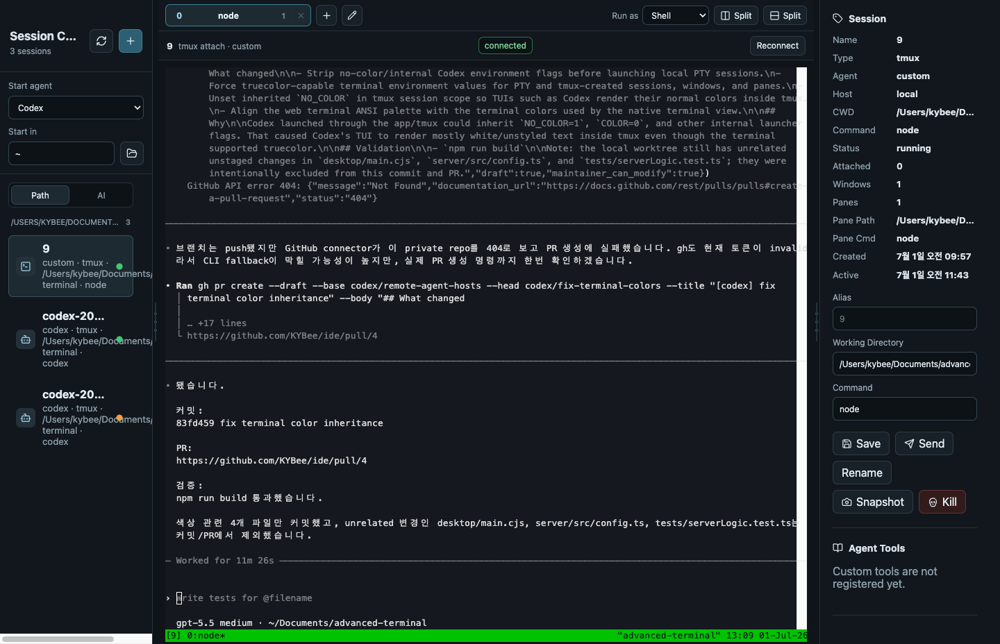

# Session Control

Session Control은 `tmux` 기반 터미널 작업을 한 화면에서 관리하는 로컬 데스크톱/웹 앱입니다.

Codex, Claude Code, Gemini, shell, 개발 서버, 빌드, 로그처럼 오래 실행되는 작업을 세션 단위로 보고, 다시 붙고, 정리할 수 있습니다. 앱을 닫아도 `tmux` 세션은 유지되므로 나중에 다시 열어 이어서 작업할 수 있습니다.



## 주요 기능

- 로컬 `tmux` 세션 목록 보기
- Codex, Claude Code, Gemini, shell 세션 시작
- 세션별 작업 디렉터리 선택
- 내장 터미널에서 세션에 attach
- 앱을 닫아도 작업 세션 유지
- 세션 rename/kill
- 프로젝트 경로 또는 AI 에이전트 기준으로 세션 그룹화
- tmux window와 pane split 관리
- pane snapshot 확인
- 세션 상태 표시
  - 초록색: 실행 중
  - 노란색/주황색: 입력 또는 승인 대기
  - 빨간색: 현재 화면 하단에서 에러 상태 감지
  - 회색: 알 수 없음 또는 idle

## 요구사항

- macOS 또는 Linux
- Node.js 20+
- npm
- tmux

선택 사항:

- Codex CLI: `codex`
- Claude Code CLI: `claude`
- Gemini/Antigravity CLI: `agy`

## 설치

```bash
npm install
```

## 실행

데스크톱 앱으로 실행:

```bash
npm run dev:desktop
```

macOS와 Linux에서 사용할 수 있습니다. macOS 전용 런처를 제외한 앱 본체는 clone한 디렉터리 기준으로 실행됩니다.

브라우저에서 실행:

```bash
npm run dev
```

그다음 브라우저에서 엽니다.

```text
http://127.0.0.1:3634
```

로컬 백엔드는 기본적으로 아래 주소에서 실행됩니다.

```text
http://127.0.0.1:3635
```

## 사용 방법

1. 왼쪽 사이드바에서 실행할 에이전트와 작업 디렉터리를 선택합니다.
2. 새 세션을 만들거나 기존 `tmux` 세션을 선택합니다.
3. 가운데 터미널에서 작업을 이어갑니다.
4. 오른쪽 패널에서 세션 이름, 작업 경로, 명령, snapshot, kill/rename 같은 작업을 관리합니다.
5. 상단 toolbar에서 새 tmux window를 만들거나 현재 window를 split할 수 있습니다.

## macOS 런처

Dock에서 실행하기 위한 로컬 런처를 설치할 수 있습니다.

```bash
npm run install:launcher
open "Session Control Launcher.app"
```

현재 런처는 개발용 Electron 앱을 편하게 여는 용도입니다. 정식 패키징된 앱은 아닙니다.

이 런처는 macOS 전용입니다. Linux에서는 `npm run dev` 또는 `npm run dev:desktop`을 사용하세요.

## 원격 Mac mini 연결

Mac mini 같은 다른 머신에서도 Session Control server를 agent 모드로 실행하면, 메인 Mac에서 원격 `tmux` 세션을 함께 볼 수 있습니다.

설정 방법은 [docs/remote-agent.md](docs/remote-agent.md)를 참고하세요.

## 검증

```bash
npm test
npm run build
```

앱이 실행 중일 때 smoke check도 실행할 수 있습니다.

```bash
npm run smoke
```
